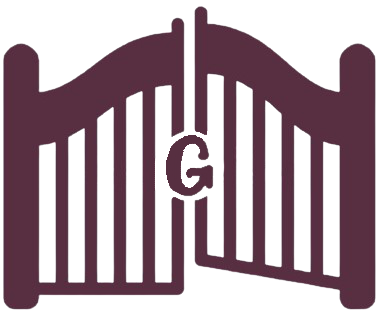

<div id="top"></div>
<!--
*** 
-->

[![][tags-shield]][tags-url]
![][lines-shield]
![][contributors-shield]
![][code-climate-shield]
[![][license-shield]](license-url)


<!-- PROJECT LOGO -->
<br />
<div align="center">
  <a href="https://github.com/gatekeeper-tamu/gatekeeper">
    
  </a>

  <h3 align="center">Gatekeeper</h3>

  <p align="center">
    A Ruby on Rails Subscription Manager Application
    <br />
    <a href="https://github.com/gatekeeper-tamu/gatekeeper"><strong>Explore the app »</strong></a>
    <br />
    <br />
    <a href="https://github.com/gatekeeper-tamu/gatekeeper/issues">Report Bug</a>
    ·
    <a href="https://github.com/gatekeeper-tamu/gatekeeper/issues">Request Feature</a>
  </p>
</div>


<!-- TABLE OF CONTENTS -->
<details>
  <summary>Table of Contents</summary>
  <ol>
    <li>
      <a href="#about-the-project">About The Project</a>
      <ul>
        <li><a href="#built-with">Built With</a></li>
      </ul>
    </li>
    <li>
      <a href="#getting-started">Getting Started</a>
      <ul>
        <li><a href="#prerequisites">Prerequisites</a></li>
        <li><a href="#installation">Installation</a></li>
      </ul>
    </li>
    <li><a href="#roadmap">Roadmap</a></li>
    <li><a href="#license">License</a></li>
    <li><a href="#contact">Contact</a></li>
    <li><a href="#acknowledgments">Acknowledgments</a></li>
  </ol>
</details>


<!-- ABOUT THE PROJECT -->
## About The Project

TODO

<p align="right">(<a href="#top">back to top</a>)</p>


### Built With

* [Ruby](https://www.ruby-lang.org/en/)
* [Rails](https://rubyonrails.org/)
* [Devise](https://github.com/heartcombo/devise)
* [Bootstrap](https://getbootstrap.com)

<p align="right">(<a href="#top">back to top</a>)</p>


<!-- GETTING STARTED -->
## Getting Started

To get a local copy up and running follow these simple example steps.

### Prerequisites

This is an example of how to list things you need to use the software and how to install them.
* npm
  ```sh
  npm install npm@latest -g
  ```
* Ruby on Rails -> [Link to installation guide](https://www.digitalocean.com/community/tutorials/how-to-install-ruby-on-rails-with-rbenv-on-ubuntu-20-04)

TODO - Determine what other packages are needed

### Installation

1. Clone the repo
   ```sh
   git clone https://github.com/gatekeeper-tamu/gatekeeper.git
   ```
TODO - Insert more steps here

<p align="right">(<a href="#top">back to top</a>)</p>


<!-- ROADMAP -->
## Roadmap

- [x] User Login
- [ ] Add/Remove/Update Subscription Entries
- [ ] Share Subscriptions
- [ ] Create Groups
- [ ] Setup Cancellation/Renewal Reminders
- [ ] Configure Group/Personal Settings
- [ ] See Statistics on Monthly Costs/Usage Data
- [ ] Explore Subscription Services and Deals
- [ ] Send Temporary Account Access to Non-Users

See the [open issues](https://github.com/gatekeeper-tamu/gatekeeper/issues) or the [pivotal tracker](https://www.pivotaltracker.com/n/projects/2547056) for a full list of proposed features (and known issues).

<p align="right">(<a href="#top">back to top</a>)</p>

<!-- LICENSE -->
## License

Distributed under the MIT License. See [`LICENSE`](LICENSE) for more information.

<p align="right">(<a href="#top">back to top</a>)</p>


<!-- CONTACT -->
## Contact

Rebecca McFadden - rmcfadden@tamu.edu

Project Link: [https://github.com/gatekeeper-tamu/gatekeeper](https://github.com/gatekeeper-tamu/gatekeeper)

<p align="right">(<a href="#top">back to top</a>)</p>


<!-- ACKNOWLEDGMENTS -->
## Acknowledgments

TODO

<p align="right">(<a href="#top">back to top</a>)</p>


<!-- MARKDOWN LINKS & IMAGES -->
<!-- https://www.markdownguide.org/basic-syntax/#reference-style-links -->
[contributors-shield]: https://img.shields.io/github/contributors/gatekeeper-tamu/gatekeeper.svg?style=for-the-badge&logo=appveyor
[contributors-url]: https://github.com/gatekeeper-tamu/gatekeeper/graphs/contributors
[lines-shield]: https://img.shields.io/tokei/lines/github/gatekeeper-tamu/gatekeeper?style=for-the-badge&logo=appveyor
[code-climate-shield]: https://img.shields.io/codeclimate/maintainability/gatekeeper-tamu/gatekeeper?style=for-the-badge&logo=appveyor
[stars-shield]: https://img.shields.io/github/stars/gatekeeper-tamu/gatekeeper.svg?style=for-the-badge&logo=appveyor
[stars-url]: https://github.com/gatekeeper-tamu/gatekeeper/stargazers
[tags-shield]: https://img.shields.io/github/v/tag/gatekeeper-tamu/gatekeeper?style=for-the-badge&logo=appveyor
[tags-url]: https://github.com/gatekeeper-tamu/gatekeeper/tags
[license-shield]: https://img.shields.io/github/license/gatekeeper-tamu/gatekeeper?style=for-the-badge&logo=appveyor
[license-url]: https://github.com/gatekeeper-tamu/gatekeeper/blob/master/LICENSE