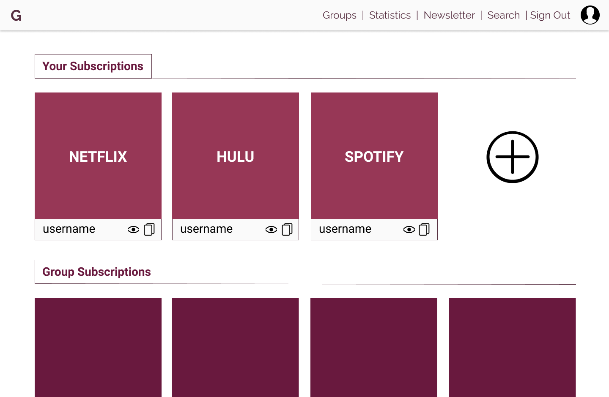
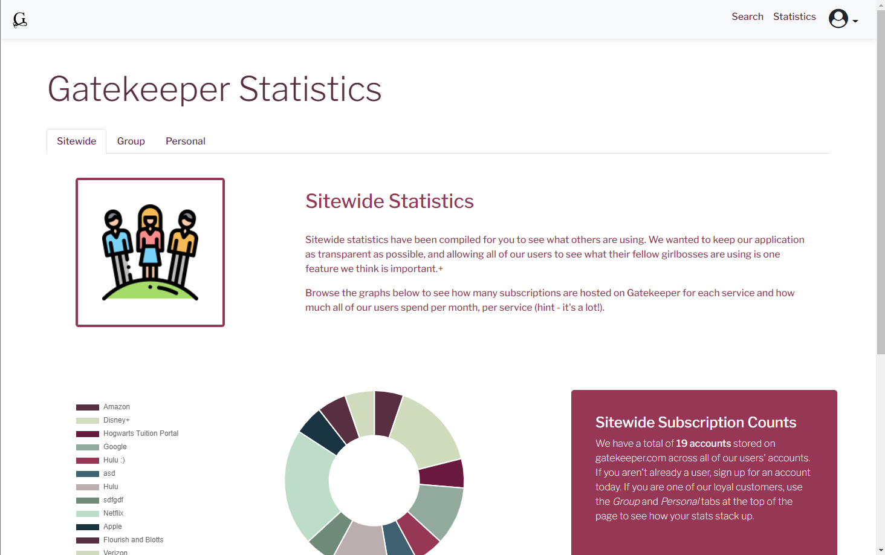

<div id="top"></div>
<br>
<br>
<br>
<br>
<br>
<br>
<br>
<br>
<br>
<br>
<!-- PROJECT LOGO -->
<br>
<div align="center">
  <a href="https://github.com/gatekeeper-tamu/gatekeeper">
    
  </a>

  <h2 align="center">Gatekeeper: Final Report</h2>

  <p align="center">
    A Ruby on Rails Subscription Manager Application
    <br />
    <a href="https://gatekeeper-tamu.herokuapp.com"><strong>Explore the app »</strong></a>
    <br>
    <br>
    <p align="center">Rebecca McFadden (Scrum Master) (Product Owner)</p>
    <p align="center">Cora English (UI Owner)</p>
    <p align="center">Grace Li (Initial Product Owner)</p>
    <p align="center">Nikhitha Vempati (Initial Scrum Master)</p>
  </p>
</div>

<div style="page-break-after: always;"></div>

<!-- TABLE OF CONTENTS -->
<h3>Table of Contents</h3>
<ol>
  <li>
    <a href="#about-the-project">About The Project</a>
    <ul>
      <li><a href="#architecture">Architecture</a></li>
    </ul>
  </li>
  <li>
    <a href="#getting-started">Getting Started</a>
    <ul>
      <li><a href="#prerequisites">Prerequisites</a></li>
      <li><a href="#installation">Installation</a></li>
    </ul>
  </li>
  <li>
    <a href="#spring-2022-development">Spring 2022 Development</a>
    <ul>
      <li><a href="#user-stories">User Stories</a></li>
      <li><a href="#figma-mockups">Figma Mockups</a></li>
      <li><a href="#iterations">Iterations</a></li>
    </ul>
  </li>
  <li>
    <a href="#tools-and-processes">Tools and Processes</a>
    <ul>
      <li><a href="#tools-and-gems">Tools and Gems</a></li>
      <li><a href="#github">GitHub</a></li>
      <li><a href="#testing">Testing</a></li>
      <li><a href="#deployment">Deployment</a></li>
    </ul>
  </li>
  <li><a href="#Links">Links</a></li>
</ol>
<p align="right">(<a href="#top">back to top</a>)</p>

<!-- ABOUT THE PROJECT -->
# About The Project

Gatekeeper is a subscription management service that allows users to store login information for online services. The service is designed for individuals, roommates, families, and other groups that have a variety of online accounts with usernames and passwords. It has
a number of useful features such as encrypted storage of username and password information and scheduleable cancellation and billing reminders. Gatekeeper also functions as a group subscription sharing service by allowing users to share login information with family and friends through groups and temporary-access pages.

Gatekeeper supports authentication via Google Oauth as well as traditional username and password. Once authenticated, users can create subscription entries, view shared subscriptions, create and join groups, and set reminders. Guest users can still see temporary access pages, as well as access our public facing search service. This feature will show users which subscription services offer shows or movies you want to watch. We also provide statistics on total costs across subscriptions, groups, or our whole site. 

Gatekeeper is not limited to streaming services. Create a group today to share logins for any account!

Rebecca McFadden is the Product Owner and Scrum Master for this project. Initially, Nikhitha Vempati was the original Scrum Master, but did not fully understand or perform the duties of this role. Grace Li was the original Product Owner, but Rebecca ended up doing all of the setup work and therefore it made more sense for her to do the majority of code reviews and architecture decisions. Cora English was in charge of all UI designs and implementation.

## Architecture

<div align="center">
    
</div>
<br>

### Models:
  - User: user information, can be created through Google or regular Auth
  - Group
    - `owner` = user reference (`belongs_to`)
    - `members` = user references (`has_many`)
  - Membership: join table (`has_many_through` for Groups <- Users)
    - `belongs_to` user
    - `belongs_to` group
  - Subscription
    - `user` = user reference (`belongs_to`)
    - `groups` = group references (`has_many`)
      - NOTE: this link is called `share_records` (ex: `group_a.share_records`)
      - For more info on `has_many` and `has_many_through` see this -> [article](http://joshfrankel.me/blog/create-a-many-to-many-activerecord-association-in-ruby-on-rails/)
  - Shared_Subscription: join table (`has_many_through` for Groups <- Subscriptions)
    - `belongs_to` subscription
    - `belongs_to` group
  - Temp_Shared_Subscription: reference to a subscription with an expiration date
    - `belongs_to` subscription
  - Reminder: db model to store reminders for subscriptions
    - `belongs_to` subscription
  - Statistic, Search, Network
    - only exist for routes and helpers

<div align="center">
    
</div>


<p align="right">(<a href="#top">back to top</a>)</p>
<div style="page-break-after: always;"></div>

<!-- GETTING STARTED -->
# Getting Started

To get a local copy up and running follow these steps.

## Prerequisites

To start, install the following packages: 
* npm
  ```sh
  curl -sL https://deb.nodesource.com/setup_12.x | sudo -E bash -
  sudo apt-get install -y nodejs
  ```

* yarn -> [Link to yarn installation instructions](https://classic.yarnpkg.com/en/docs/install)

* Ruby on Rails -> [Link to Digital Ocean installation guide for Ubuntu](https://www.digitalocean.com/community/tutorials/how-to-install-ruby-on-rails-with-rbenv-on-ubuntu-20-04)

* Install PostgreSQL and binaries -> Install from [here](https://www.postgresql.org/download/) then:
  ``` sh
  sudo apt install libpq-dev
  ```

* Install bundler
  ```sh
  gem install bundler
  ```

* Install the Heroku CLI -> [Link to instructions](https://devcenter.heroku.com/articles/heroku-cli)

* Setup Google Oauth access -> [Link to setup Google Auth project](https://support.google.com/cloud/answer/6158849?hl=en)

* Setup a [AWS KMS master key](https://console.aws.amazon.com/kms/home#/kms/keys) using [AWS setup instructions for the kms_encryped gem](https://github.com/ankane/kms_encrypted#aws-kms)

* redis -> [Link to redis installation instructions](https://redis.io/docs/getting-started/)

* Setup a Gmail for the project

## Installation

1. Clone the repo
   ```sh
   git clone https://github.com/gatekeeper-tamu/gatekeeper.git
   ```
2. Navigate to directory and install gems
    ```sh
    cd gatekeeper
    bundle install
    ```
3. Setup environment variables
    - Create `.env` file in the root directory with the following:
      ```sh
      GOOGLE_CLIENT_ID="insert_google_client_id_here"
      GOOGLE_CLIENT_SECRET="insert_google_client_secret_here"
      AWS_ACCESS_KEY_ID="..."
      AWS_SECRET_ACCESS_KEY="..."
      KMS_KEY_ID="..."
      AWS_REGION="..."
      GMAIL_EMAIL="..."
      GMAIL_PASSWORD="..."
      ```
4. Create or set heroku project
    ```sh
    heroku create
    ```
5. Setup the database
    - Make sure postgres is started and your user is created/has db access
      ```sh
      sudo service postgresql start
      sudo -u postgres createuser -s <your username> -P
      ```
    - Intitialize db
      ```sh
      rake db:setup
      ```
6. Setup webpacker
    ```sh
    bundle exec rake webpacker:install
    yarn install
    ```
7. Run the app:
    - To run locally (`localhost:5000`):
      ```sh
      heroku local
      ```
    - To deploy to heroku:
        - Export all environment variables from `.env` file
          ```sh
          heroku config:set ENVIRONMENT_VARIABLE="value_here"
          ```
        - Set git remote for heroku:
          ```sh
          heroku git:remote -a <your app name>
          git push heroku master
          ```

<p align="right">(<a href="#top">back to top</a>)</p>
<div style="page-break-after: always;"></div>

<!-- ROADMAP -->
# Spring 2022 Development

## User Stories

NOTE: All stories include cucumber and rspec testing requirements

Key:
- Owners
  - RM = Rebecca McFadden (Product Owner, Dev Lead, Scrum Master)
  - CE = Cora English (UI Owner)
  - GL = Grace Li
  - NV = Nikhitha Vempati
- Points
  - 1 = Low effort, less than 2 hours of dev time
  - 2 = Some effort, less than 4 hours of dev time
  - 3 = Mid effort, requires research and less than 6 hours of dev time
  - 4 = More effort, more research, testing and roughly 8 hours of dedicated dev time
  - 5 = Max effort, biggest story that won't be split up, lots of research and a full weeks (10hrs) of dev time

| # / PR# | Title  | Points  | Owner | Description | Comments |
| ------- | ------ | ------- | ----- | ----------- | -------- |
| 1 / XX | [User Feature] - OAuth with Username/password | 2 | RM | Setup for Devise Gem with username and password. Login page. |  |
| 2 / XX | [User Feature] - OAuth with Google | 2 | RM | Configure Google Oauth for Devise. Setup google project. Refactor login page. |  |
| 3 / 1 | [Setup Feature] - UI shells | 0 | CE | Setup base UI task. |  |
| 4 / XX | [Setup Feature] - Setup database | 0 | GL, NV | As a developer, I need to be able to add/remove data from a database through ruby so that I can store/access data necessary to provide service to the users |   |
| 5 / 40 | [Cleanup Feature] - User UUID as id for user instead of sequential ActiveRecord number | 1 | RM | As a developer, I want to be able to generate UUIDs for Users and other models so that the ids for new entries are unique identifiers |  |
| 6 / 57 | [User Feature] - Profile/Friends pages | 2 | RM | As a user, I want to be able to view my profile as well as other users' profiles so that I can view and update my own data as well as view friends | Edited, originally you weren't going to be able to view other users |
| 7 / 41 | [Subscription Feature] - Add subscriptions to users | 3 | RM | As a user, I want to be able to create, view, edit, and delete my subscription entries. | Includes data model, CRUD, routing, associate model with users |
| 8 / 56 | [Groups Feature] - CRUD for Groups | 3 | RM | As a user, I want to be able to create/update/delete groups so that I can share passwords with my friends/family | Same as above |
| 9 / 59 | [Groups Feature] - Users can be added to Groups | 4 | RM | As a user, I want to be able to add/remove users to/from groups so that I can manage who can view shared subscriptions | Upgraded from 2 to 4 points |
| 10 / 60 | [Groups Feature] - Group Subscriptions on View Page | 1 | RM | As a user, I want to be able to view subscriptions that belong to my groups on the main view page | |
| 11 / 66 | [Statistics Feature] - Statistics view page | 1 | CE | As a user, I want to be able to view statistics so that I can be more informed about my subscription usage/cost | |
| 12 / 60 | [Groups Feature] - Subscriptions can be added to groups | 4 | RM | As a user, I want to be able to add subscriptions I own to my groups on the group view page | Upgraded from 3 to 4 points |
| 13 / 69 | [Reminder Feature] - Send reminders emails | 2 | GL, NV | As a user, I want to be able to receive an email message when my subscription alert is up so that I can be reminded to cancel/renew/pay for my subscription | |
| 14 / 69 | [Reminder Feature] - Subscription CRUD | 1 | GL, NV | As a user, I want to be able to add (a) date(s) to my subscriptions so that I can know when to cancel/renew my subscription | |
| 15 / 73 | [Statistics Feature] - Sitewide statistics | 1 | CE | As a user, I want to be able to view sitewide statistics so that I can see what other people are spending money on/using | |
| 16 / 79 | [Groups Feature] - Group permissions | 5 | RM | As a group owner, I want to be able to set permissions for the subscriptions in my groups so that I can control which users have read/write permissions | Upgraded from 3 to 5 points |
| 17 / 81 | [Statistics Feature] - Cost Statistics | 2 | CE | As a user, I want to be able to view cost statistics so that I know how much I'm spending over periods of time | |
| 18 / 84 | [Groups Feature] - Subscription permissions | 5 | RM | As a user, I want to be able to set permissions for the subscriptions I add to groups so that I can control which groups have read/write permissions | Upgraded from 3 to 5 points |
| 19 / 78 | [Reminders Feature] - Subscription Reminders | 2 | GL | As a user, I want to be able to add a reminder to a subscription so that I can receive emails for my subscription important dates | |
| 20 / 89 | [Reminders Feature] - Clean UI | 2 | GL | As a user, I want to be able to create Reminders in a user-friendly way | |
| 21 / 78 | [Reminders Feature] - Reminder email sends at scheduled time | 1 | GL | As a user, I want to be able to schedule reminders so that I can get notifications at specific times for my reminders | Added to fix lack of development in initial reminders story |
| 22 / 90 | [Sharing Feature] - One-time Access Page | 4 | RM | As a user, I want to be able to share a subscription with a friend through a one-time access page so that I can give access to my subscription for a limited time. A page with minimal information should be generated at a static address that can be sent as a link in the email to the intended recipient. The page should display the username and password as well as the URL of the service. The non-auth navbar should be shown | Initially assigned to NV |
| 23 / 86 | [Search Feature] - Search Page | 3 | NV | As a user, I want to be able to query the database of services and shows so that I can find platforms that have content I want or find alternatives to platforms I currently use | |
| 24 / 88 | [Statistics Feature] - View group statistics | 2 | CE | As a user, I want to be able to view statistics about my groups so that I can understand what my group is paying for/using | Usage statistics removed |
| 25 / 94 | [Sharing Feature] - Send email to recipient | 2 | RM | As a user, I want to be able to share a subscription with a friend through a one-time access page so that I can give access to my subscription for a limited time. Link to the page with minimal information should be generated at a static address that and sent to the correct email | Includes new account email mailer |
| 26 / 95 | [UI Feature] - Cleanup Group View Page | 2 | CE | As a user, I want to be able to view groups and their details in a clean format. Match UI to Figma mockups. Update Cucumber tests if any fail post UI change | Added to address intial UI issues |
| 27 / 96 | [Search Feature] - Use API to populate database | 3 | NV | As a developer, I want to populate a database with movie and TV show data so that I can show users what services have shows/movies they want to watch | Altered - no longer includes background service to fetch data |
| 28 / 92 | [Reminder Feature] - Recurring Reminders | 2 | GL | As a user, I want to be able to schedule recurring reminders for my subscriptions | |
| 29 / 103 | [UI Feature] - Landing Page Restyle | 1 | CE | As a user, I want to be able to have a better experience on the landing page | Added to address intial UI issues |
| 30 / 106 | [UI Feature] - Restyle Sign up / Log in Pages | 1 | CE | As a user, I want to be able to have a better experience on the login and sign up pages | Added to address intial UI issues |
| 31 / 120 | [Cleanup Feature] - Validate form data | 1 | NV | As a developer, I want to be able to make sure that user-entered data conforms to the expected values so that I can have a secure application |  Started |
| 32 / 114 | [UI Feature] - Clean up Search page | 1 | CE | Make Search page UI match Figma mockups | Added to address intial UI issues |
| 33 / 113 | [UI Feature] - Subscription Page Restyle | 2 | CE | As a user, I want to be able to have a better experience on the subscription pages | Added to address intial UI issues |
| 34 / 113 | [UI Feature] - Reminders Restyle | 1 | CE | As a user, I want to be able to view a cleaner reminders page so that it looks like it fits with subscriptions | Added to address intial UI issues |
| 35 / 113 | [UI Feature] - Temp Sharing Pages Restyle | 1 | CE | As a user, I want to be able to view a cleaner temp sharing page so that it looks like it fits with subscriptions | Added to address intial UI issues |
| 36 / 113 | [UI Feature] - User profile icons | 1 | NV, GL | As a user, I want to be able to view my profile picture/gravatar | Started |
| 37 / XX | [Users Feature] - Premium Plan | 1 | GL | As a product owner, I want to be able to have premium users with more features so that I can charge more for premium service | Iced - Not enough time to implement |
| 38 / XX | [Statistics Feature] - Usage Statistics | 2 | CE | As a user, I want to be able to view usage statistics so that I know how much I'm using subscriptions over periods of time | Iced - Decided it was not useful |

See the [open issues](https://github.com/gatekeeper-tamu/gatekeeper/issues) or the [pivotal tracker](https://www.pivotaltracker.com/n/projects/2547056) for a full list of proposed features (and known issues).

## Figma Mockups

| Figma | Screenshot |
| ----- | ---------- |
|  |  |
|  |  |
|  |  |
|  |  |
|  |  |
|  |  |
|  |  |
|  |  |
|  |  |

## Iterations

| # | Points | Summary | Customer Demo Date |
| ----- | ----- | ----- | ------ |
| 0 | 0 | Report and plans for the project | 29th December 2021 - 12:00 PM - YMCA building |
| 1 | 4 | Setup basic app, auth, created models for users and subscriptions, initial landing page, fixed routing and callbacks for auth, devise page styling, cucumber tests for sign in, out, and up scenarios | 2nd January 2022 - 6:45 PM - Makedonia Palace Hotel |
| 2 | 6 | Ids changed to UUIDs, Subscription encryption, styling for subscriptions, Profile page | 4th February 2022 - 2:30 PM - Peterson |
| 3 | 17 | Data models/routes for groups, Add users to groups, Setup code analysis,  Add subscriptions to groups, Statistics view page, Send reminders for subscriptions, View sitewide statistics | 24th February 2022 - 3:10 PM - Peterson |
| 4 | 9 | Rspec testing for existing models/controllers, Group Permissions, Personal Statistics | 24th March 2022 - 3:00 PM - Peterson |
| 5 | 28 | Subscription permissions, Subscription reminders, Date Picker for Reminders, Search for tv shows and movies, One-time Access Page, Recurring Reminders, Send email to recipient, Group UI Cleanup, Group statistics, Use API to populate database | 14th April 2022 - 9:30 AM - Zoom |
| 6 | 10 | Restyle landing page, login, sign-up/in, subscriptions, reminders, temp sharing, and search page, validate form data, user profile icons | 29th April 2022 - 1:45 PM - Zoom |


<p align="right">(<a href="#top">back to top</a>)</p>
<div style="page-break-after: always;"></div>

<!-- TOOLS AND PROCESSES -->
# Tools and Processes

## Tools and Gems

* [Code Climate](https://codeclimate.com/): Automated code review for pull requests and quality maintenance 
* [GitHub Projects](https://docs.github.com/en/issues/trying-out-the-new-projects-experience/about-projects): GitHub supported Iteration Planning feature
* [Zapier](https://zapier.com/): Automation service to copy github user stories over to Pivotal Tracker
* [Devise](https://github.com/heartcombo/devise): Authentication gem, shells for Oauth views and controllers
* [Bootstrap](https://getbootstrap.com): Pretty UI
* [attr_encrypted](https://github.com/attr-encrypted/attr_encrypted): Encrypts attributes for rails models
* [kms_encrypted](https://github.com/ankane/kms_encrypted): Creates kms keys for rails encryption
* [chartkick](https://github.com/ankane/chartkick): Pretty JS Charts for Ruby
* [sidekiq](https://sidekiq.org/): Background tasks for scheduling reminder emails
* [SimpleForm](https://github.com/heartcombo/simple_form): Easier form API for Rails
* [SimpleCov](https://github.com/simplecov-ruby/simplecov): Code coverage analysis gem
* [Faker](https://github.com/faker-ruby/faker): Library for generating fake data for rspec tests
* [Cucumber](https://github.com/cucumber/cucumber-rails): Gem with generators and support for cucumber feature testing 

For more information on gems and tools we used, visit our [dependencies report](https://github.com/gatekeeper-tamu/gatekeeper/network/dependencies) on GitHub.

We used a Google Cloud project for Oauth and an AWS project for KMS (encryption) key management. There were little to no issues setting this up. Instructions on setting this up are linked in the [getting-started](#getting-started) section. 

## GitHub

Our team had a few standards around GitHub and development processes that helped us maintain quality and efficiency. We used the [Pivotal Tracker GitHub plugin](https://www.pivotaltracker.com/help/articles/github_integration/) to link branches and PRs to stories on Pivotal. We used Zapier (linked above) to copy all of our GitHub project User Stories to Pivotal. 

To standardize User Stories and Bugs, Rebecca created GitHub issue templates (can be found on the repo under [.github/ISSUE_TEMPLATE](../../.github/ISSUE_TEMPLATE/)). All issue titles are formatted as "[Category Feature] - Description". All User Stories and Bugs have Acceptance Criteria which include key features that should be developed to complete the story as well as testing requirements. Our development process worked as follows:

1. Issue is created and assigned
2. A branch (off the current `main` branch) with a name in the format "name"/"issue description"_"pivotal #" (ex: `rmcfad/profile_icons_12345`) is created for development
3. PR is created, title matches the issue being developed, issue is linked to the PR
4. Branch is deployed to the test Heroku environment
5. PR is reviewed by the code owner
    - to be accepted, the PR must contain new tests and all current tests must pass
6. Devlopment branch is synced with `main`
    - `pull --rebase origin main`
    - fix conflicts
    - `push --force-with-lease origin HEAD`
    - see [article](https://www.digitalocean.com/community/tutorials/how-to-rebase-and-update-a-pull-request) for more info
6. Branch is merged with closing tags for Pivotal Tracker (see [article](https://www.pivotaltracker.com/help/articles/github_integration/))
7. Pivotal Tracker story is Accepted/Rejected and closed

The main branch was locked to only allow commits via PRs after Iteration 1. All PRs also required at least 1 approving review to be merged. The repo was also configured to only allow PRs to be [squashed and merged](https://docs.github.com/en/pull-requests/collaborating-with-pull-requests/incorporating-changes-from-a-pull-request/about-pull-request-merges#:~:text=When%20you%20select%20the%20Squash,merged%20into%20the%20default%20branch.) so that the only commits on the `main` branch were singular commits per PR. 

Each Iteration had an associated [Release](https://github.com/gatekeeper-tamu/gatekeeper/releases) of the code. We created Releases using the GitHub Release feature. A release was published using a new tag (ex: v2.0, v3.0) on the GitHub web app. 

There were some development spikes mostly due to the fact that there were a few iterations where only one (or sometimes two) team members did any significant work. 

## Testing

All of our user stories were written in terms of the behaviors expected at the completion of the user story. We had both Cucumber and Rspec tests. Rspec tests were written before the code about 50% of the time. We then made sure the key functionality of each user story (issue) was tested in unit and functional tests before a PR was merged. In the case of a bug fix, we made sure that the scenario that caused the bug in the first place was tested to verify that future developement would not cause the same issue. 

Since we only did Test Driven Development (TDD) around 50% of the time, we occasionally had tests that were more tailored to the happy path instead of a comprehensive examination of code functionality. However, since the acceptance criteria of each user story/bug included testing requirements, we ended up with a large suite of tests and decent metrics for the quality of our appliation. By making sure each new feature was tested properly, we were actually able to catch some bugs caused by new development before PRs were merged.

## Deployment

We had two Heroku deployment environments: one for testing and one production environment. Before each PR was merged, we deployed the branch to the test Heroku environment to verify that the code functioned outside of a local development environment. 

Both environments were set up with GitHub access. This allowed us to see the status of a GitHub deployment on the PR UI and the main GitHub page. (NOTE: As of 4/19/2022, this service was disabled because of Heroku security breach) This access also allowed us to have our `main` branch auto-deploy to the production environment. 

<p align="right">(<a href="#top">back to top</a>)</p>


<!-- LINKS -->
# Links

- [Pivotal Tracker](https://www.pivotaltracker.com/n/projects/2547056)
- [GitHub](https://github.com/gatekeeper-tamu/gatekeeper)
- [Deployed App](https://gatekeeper-tamu.herokuapp.com/)
- [Slide Presentation Video](https://drive.google.com/file/d/1tWaBk9AkyLokxtKJzyeq5NKA02i10Z9g/view?usp=sharing) -> Must be signed in with TAMU Google Drive account


<p align="right">(<a href="#top">back to top</a>)</p>